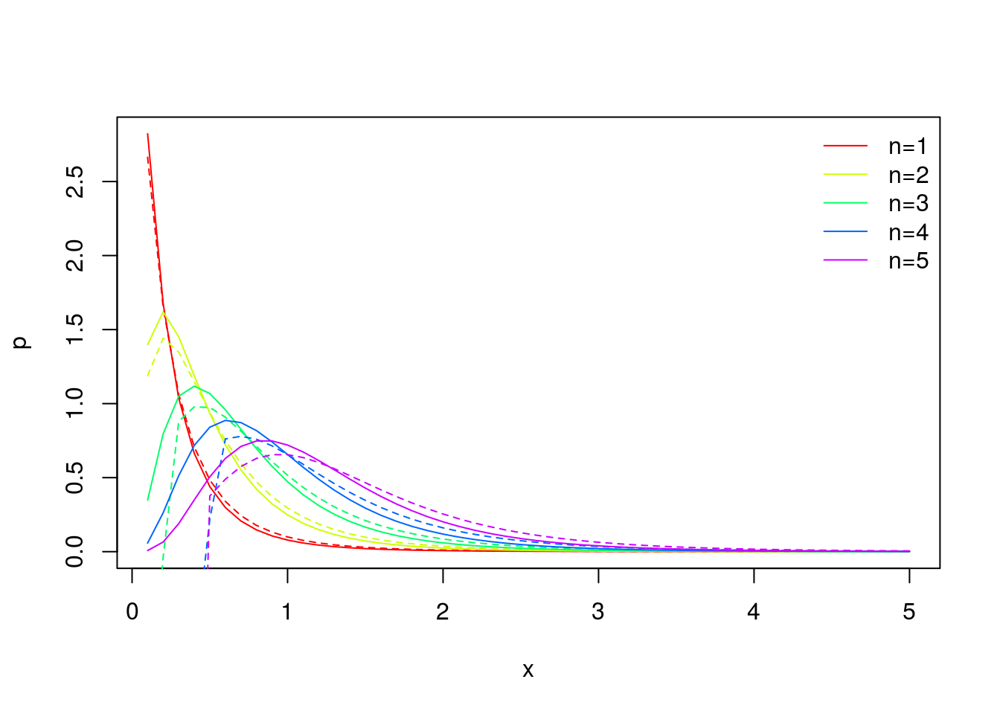

[](https://travis-ci.org/mpadge/paretoconv) [](http://www.repostatus.org/#concept) [](http://cran.r-project.org/web/packages/paretoconv) [](https://codecov.io/gh/mpadge/paretoconv)

`paretoconv` contains only one function:

    paretoconv (x, a, n)

which calculates the *n*-fold convolution of two Pareto distributions, *f(x)=a x<sup>1-a</sup>*, for *x&gt;0*, *a&gt;1* using the techniques devised by Colin Ramsay in

1.  'The Distribution of Sums of Certain I.I.D. Pareto Variates' (*Communications in Statistics - Theory and Methods* **35**:395-405, 2006); and

2.  'The Distribution of Sums of I.I.D. Pareto Random Variables with Arbitrary Shape Parameter' (*Communications in Statistics - Theory and Methods* **37**:2177-2184, 2008).

### News

-   Initial working version

### Installation

``` r
devtools::install_github("mpadge/paretoconv")
```

### Usage

``` r
library(paretoconv)
packageVersion("paretoconv") # current verison
#> [1] '0.0.0'
paretoconv (x=0:5, a=1, n=5, cdf=FALSE)
#> [1] -1.443290e-16  7.346382e-03  2.983546e-02  4.831499e-02  5.749632e-02  5.971471e-02
```

Note that `x` can be a vector, while both `a` and `n` must single-valued.

### Example

Solid lines in this panel are a reproduction of Ramsay's (2006) Figure 2 of probability density functions for the first 5 convolutions of the Pareto pdf with shape parameter of *a=5*. Dashed lines are analogous values for the non-integer value of *a=4.5*.

``` r
x <- 1:50 / 10
n <- 1:5
yint <- lapply (n, function (i) paretoconv (x=x, a=5, n=i))
ynon <- lapply (n, function (i) paretoconv (x=x, a=4.5, n=i))
cols <- rainbow (length (n))
plot (NULL, NULL, xlim=range (x), ylim=range (yint), xlab="x", ylab="p")
for (i in n) {
    lines (x, yint [[i]], col=cols [i])
    lines (x, ynon [[i]], col=cols [i], lty=2)
}
legend ("topright", lwd=1, col=cols, bty="n", 
        legend=sapply (seq (n), function (i) paste0 ("n=", i)))
```



### Test Results

``` r
library(paretoconv)
library(testthat)

date()

test_dir("tests/")
```
